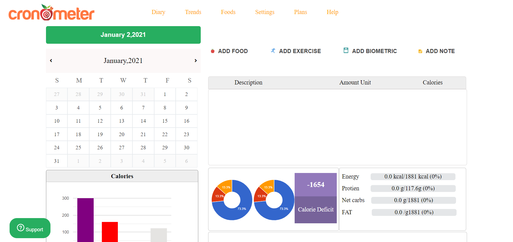

# Cronometer clone By Team Phosphorous
###### Titans Unit-2 Project

# Cronometer (clone) 

Cronometer is a website for counting calories and tracking your diet and health metrics.

In this project we have tried to make a look alike clone of cronometer. With our efforts and the technology stack, that we have learned so far in the masai school, we were able to clone the front end with high precision and quality.

# Technology Stack Used 💻

In this project we have used the following tech stack.

- HTML <i class="devicon-html5-plain colored"></i>
- CSS <i class="devicon-css3-plain colored"></i>
- Javascript <i class="devicon-javascript-plain colored"></i>

 

## How to browse through the project? 🤔

In order to use the project you need to follow the below steps.

1.  This is our Landing page. On clicking on login you will be redirected to login page
    

2.  This is our Login page.
    
    
3.  After your giving email and password you will be redirected to dairy page.
    

4.  This is our Trends page.
    

5.  This is our Foods page.
    

6.  This is our Settings page.
    

7.  This is our Help page.
    

 

## Team Members and Contributors 😇

👤 **Suraj Kumar**

- Github: [iharshgaur](https://github.com/Digitalsuraj)
- Linkedin: [Harsh Gaur
  ](https://www.linkedin.com/in/digitalsurajbabu/)

👤 **Sahil Raj**

- Github: [pushpal99](https://github.com/sahil2019)
- Linkedin: [Pushpal Chakrabarty](https://www.linkedin.com/in/)

👤 **K Pavan Kumar**

- Github: [ankurpoplu](https://github.com/pavangoudk)
- Linkedin: [Ankur Pandey](https://www.linkedin.com/in/k-pavan-kumar-613345aa/)
